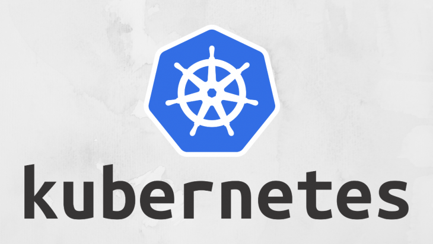
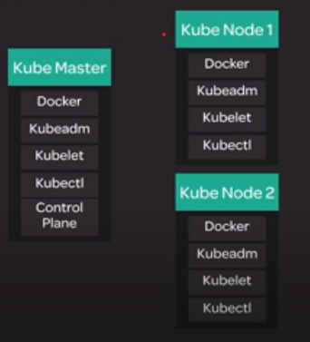

# Kubernetes

Kubernetes is a container orchestration system  




## Cluster Architecture

  

<p  align=center>

</p>

 - `Docker` is basically a container engine which is use to create containers on top of an operating system and automates application deployment on the container.
 - `Kubeadm` is a new tool that is part of the Kubernetes distribution as of 1.4.0 which helps you to install and set up a Kubernetes cluster.
 - `Kubelet` is responsible for maintaining and managing a set of pods, which are composed of one or more containers, on a local system. Within a Kubernetes cluster, it act as a local agent that watches for pod specs via the Kubernetes API server.
 - `Kubectl` is a command line tool for controlling Kubernetes clusters.
 - `Control Plane` is a series of different services that form the Kubernetes Master structure, that allows the kubernetes master to control the cluster.
  
### Table of Contents
- [Building a Cluster](#Building-a-Cluster)
- [scenario 1](./scenario1.md)
- [Containers and Pods](./container-pods.md)
- [Clustering and Nodes](./cluster-nodes.md)
- [Networking in Kubernetes](./network.md)
- [Kubernetes Architecture and components](./architecture-components.md)
- [Kubernetes Deployments](./deployments.md)
- Kubernetes Services
- scenario 2
- scenario 3

## Building a Cluster
### Setup Server

  

For building the cluster we need three servers of **ubuntu distribution**.</br>

  

**Note:**  You can use AWS EC2 instance to initiate the server.

  

**Tag:</br>**

  

-  **For Server 1**: Kube Master </br>

-  **For Server 2**: Kube Node 1 </br>

-  **For Server 3**: Kube Node 2 </br>

  

  

### Setup Docker

<p>The first step in setting up a new cluster is to install a container runtime such as Docker.</p>

<p>We will be installing Docker on our three servers in prearation for standing up a Kubernetes cluster.</p>

  

Here are the commands :

  

```

curl -fsSL https://download.docker.com/linux/ubuntu/gpg | sudo apt-key add -

  

sudo add-apt-repository \

"deb [arch=amd64] https://download.docker.com/linux/ubuntu \

$(lsb_release -cs) \

stable"

  

sudo apt-get update

  

sudo apt-get install -y docker-ce=18.06.1~ce~3-0~ubuntu

  

sudo apt-mark hold docker-ce

  

```

  

You can verify that docker is working by running this command:

  

```

sudo docker version

```

  

### Setup Kubeadm, Kubelet, and Kubectl

<p>Now that Docker is installed, we are ready to install the Kubernetes components.</p>

  

**Run these commands on all three servers.**</br>
You can work around this by using version 1.12.7-00 for kubelet, kubeadm, and kubectl.

```
curl -s https://packages.cloud.google.com/apt/doc/apt-key.gpg | sudo apt-key add -

cat << EOF | sudo tee /etc/apt/sources.list.d/kubernetes.list
deb https://apt.kubernetes.io/ kubernetes-xenial main
EOF

sudo apt-get update

sudo apt-get install -y kubelet=1.12.7-00 kubeadm=1.12.7-00 kubectl=1.12.7-00

sudo apt-mark hold kubelet kubeadm kubectl
```
After installing these components, verify that Kubeadm is working by getting the version info.

```
kubeadm version
```

### Bootstrapping the Cluster
Now we are ready to get a real Kubernetes cluster up and running!. We will bootstrap the cluster on the Kube master node. Then, we will join each of the two worker nodes to the cluster, forming an actual multi-node Kubernetes cluster.

Here are the commands used in this lesson:

-   On the Kube master node, initialize the cluster:
    
    ```
    sudo kubeadm init --pod-network-cidr=10.244.0.0/16
    
    ```
    
    That command may take a few minutes to complete.
-   When it is done, set up the local kubeconfig:
    
    ```
    mkdir -p $HOME/.kube
    sudo cp -i /etc/kubernetes/admin.conf $HOME/.kube/config
    sudo chown $(id -u):$(id -g) $HOME/.kube/config
    
    ```
    
-   Verify that the cluster is responsive and that Kubectl is working:
    
    ```
    kubectl version
    
    ```
    
    You should get  `Server Version`  as well as  `Client Version`. It should look something like this:
    
    ```
    Client Version: version.Info{Major:"1", Minor:"12", GitVersion:"v1.12.2", GitCommit:"17c77c7898218073f14c8d573582e8d2313dc740", GitTreeState:"clean", BuildDate:"2018-10-24T06:54:59Z", GoVersion:"go1.10.4", Compiler:"gc", Platform:"linux/amd64"}
    Server Version: version.Info{Major:"1", Minor:"12", GitVersion:"v1.12.2", GitCommit:"17c77c7898218073f14c8d573582e8d2313dc740", GitTreeState:"clean", BuildDate:"2018-10-24T06:43:59Z", GoVersion:"go1.10.4", Compiler:"gc", Platform:"linux/amd64"}
    
    ```
    
-   The  `kubeadm init`  command should output a  `kubeadm join`  command containing a token and hash. Copy that command and run it with  `sudo`  on both worker nodes. It should look something like this:
    
    ```
    sudo kubeadm join $some_ip:6443 --token $some_token --discovery-token-ca-cert-hash $some_hash
    
    ```
    
-   Verify that all nodes have successfully joined the cluster:
    
    ```
    kubectl get nodes
    
    ```
    
    You should see all three of your nodes listed. It should look something like this:
    
    ```
    NAME                      STATUS     ROLES    AGE     VERSION
    wboyd1c.mylabserver.com   NotReady   master   5m17s   v1.12.2
    wboyd2c.mylabserver.com   NotReady   <none>   53s     v1.12.2
    wboyd3c.mylabserver.com   NotReady   <none>   31s     v1.12.2
    
    ```
    
    **Note:**  The nodes are expected to have a STATUS of  `NotReady`  at this point.

### Configuring Networking with Flannel
Once the Kubernetes cluster is set up, we still need to configure cluster networking in order to make the cluster fully functional. We will walk through the process of configuring a cluster network using Flannel.

Here are the commands used in this lesson:

-   On all three nodes, run the following:
    
    ```
    echo "net.bridge.bridge-nf-call-iptables=1" | sudo tee -a /etc/sysctl.conf
    sudo sysctl -p
    
    ```
    
-   Install Flannel in the cluster by running this only on the Master node:
    
    ```
    kubectl apply -f https://raw.githubusercontent.com/coreos/flannel/bc79dd1505b0c8681ece4de4c0d86c5cd2643275/Documentation/kube-flannel.yml
    
    ```
    
-   Verify that all the nodes now have a STATUS of  `Ready`:
    
    ```
    kubectl get nodes
    
    ```
    
    You should see all three of your servers listed, and all should have a STATUS of  `Ready`. It should look something like this:
    
    ```
    NAME                      STATUS     ROLES    AGE     VERSION
    wboyd1c.mylabserver.com   Ready      master   5m17s   v1.12.2
    wboyd2c.mylabserver.com   Ready      <none>   53s     v1.12.2
    wboyd3c.mylabserver.com   Ready      <none>   31s     v1.12.2
    
    ```
    
    **Note:**  It may take a few moments for all nodes to enter the  `Ready`  status, so if they are not all  `Ready`, wait a few moments and try again.
    
-   It is also a good idea to verify that the Flannel pods are up and running. Run this command to get a list of system pods:
    
    ```
    kubectl get pods -n kube-system
    
    ```
    
    You should have three pods with  `flannel`  in the name, and all three should have a status of  `Running`.