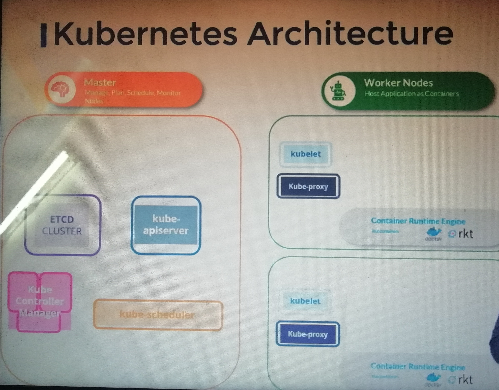
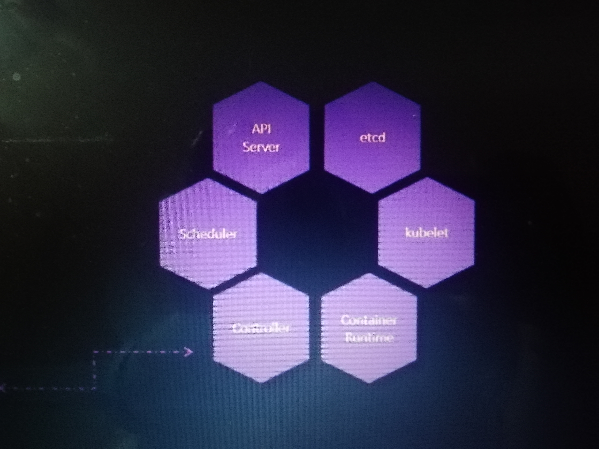

## Kubernetes Architecture and components



Kubernetes includes multiple components that work together to provide the functionality of a kubernetes cluster.



The control plane components manage and control the cluster.

 - `etcd`: provides distributed, synchronized data storage for the cluster state.
 - `kube-apiserver`: Serves the Kubernetes API, the primary interface for the cluster.
 - `kube-controller-manager`: Bundles several components into one package.
 - `kube-scheduler`:  Schedules pods to run on individual nodes.

In addition to the control plane, each node also has:
 - `Kublete`: Agent that executes containers on each node.
 - `Kube-proxy`: Handles network communication between nodes by adding firewall routing rules.

With kubeadm, many of these components are run as pods within the cluster itself.


A Kubernetes cluster is made up of multiple individual components running on the various machines that are part of the cluster. The 

Here are the commands to see the major Kubernetes software components and what each of them do and how these components are actually running in our cluster currently.:

-   Get a list of system pods running in the cluster:
    
    ```
    kubectl get pods -n kube-system
    
    ```
    
-   Check the status of the  `kubelet`  service:
    
    ```
    sudo systemctl status kubelet
    ```
