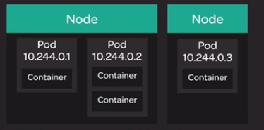

## Container and Pods
Pods are the smallest and most basic building blocks of the kubernetes model.
A pod consists of one or more containers, storage resources, and a unique IP address in the Kubernetes cluster network.

<p align=center>
  
</p>

In order to run containers, kubernetes `schedules` pods to run on servers in the cluster. When a pod is scheduled, the server will run the containers that are part of the pod.

In order to run and manage containers with Kubernetes, you will need to use pods. We will create a simple pod and then we will look at some ways to explore and interact with pods in your Kubernetes cluster.

Here are the commands used in this lesson:

-   Create a simple pod running an nginx container:
    
    ```
    cat << EOF | kubectl create -f -
    apiVersion: v1
    kind: Pod
    metadata:
      name: nginx
    spec:
      containers:
      - name: nginx
        image: nginx
    EOF
    
    ```
    
-   Get a list of pods and verify that your new nginx pod is in the  `Running`  state:
    
    ```
    kubectl get pods
    
    ```
    
-   Get more information about your nginx pod:
    
    ```
    kubectl describe pod nginx
    
    ```
    
-   Delete the pod:
    
    ```
    kubectl delete pod nginx
    ```