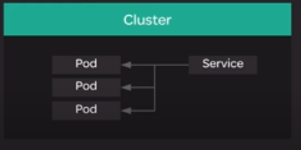
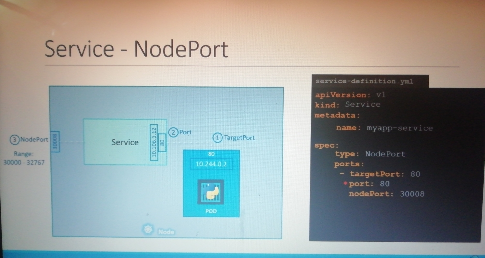

## Kubernetes Services

`Services` are another important component of deploying apps with Kubernetes.

<p align=center>
  
</p>

Services allow you to dynamically access a group of replica pods. Replica pods are often being created and destroyed, so what happends to other pods or external entities which need to access those pods?

A service creates an abstraction layer on top of a set of replica pods. You can access the service rather than accessing the pods directly, so as pods come and go, you get uninterrupted, dynamic access to whatever replicas are up at the time.

While deployments provide a great way to automate the management of your pods, you need a way to easily communicate with the dynamic set of replicas managed by a deployment. This is where services come in. In this lesson, we will discuss what services are in Kubernetes, demonstrate how to create a simple service, and explore that service in our own cluster.

`Service Node Port`



Here are the commands used in the demonstration:

-   Create a NodePort service on top of your nginx pods:
    
    ```
    cat << EOF | kubectl create -f -
    kind: Service
    apiVersion: v1
    metadata:
      name: nginx-service
    spec:
      selector:
        app: nginx
      ports:
      - protocol: TCP
        port: 80
        targetPort: 80
        nodePort: 30080
      type: NodePort
    EOF
    
    ```
    
-   Get a list of services in the cluster.
    
    ```
    kubectl get svc
    
    ```
    
    You should see your service called  `nginx-service`.
-   Since this is a NodePort service, you should be able to access it using port 30080 on any of your cluster's servers. You can test this with the command:
    
    ```
    curl localhost:30080
    
    ```
    
    You should get an HTML response from nginx!